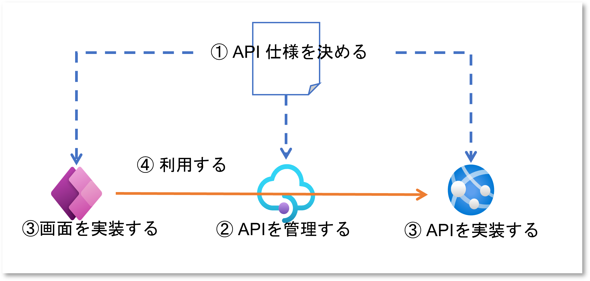
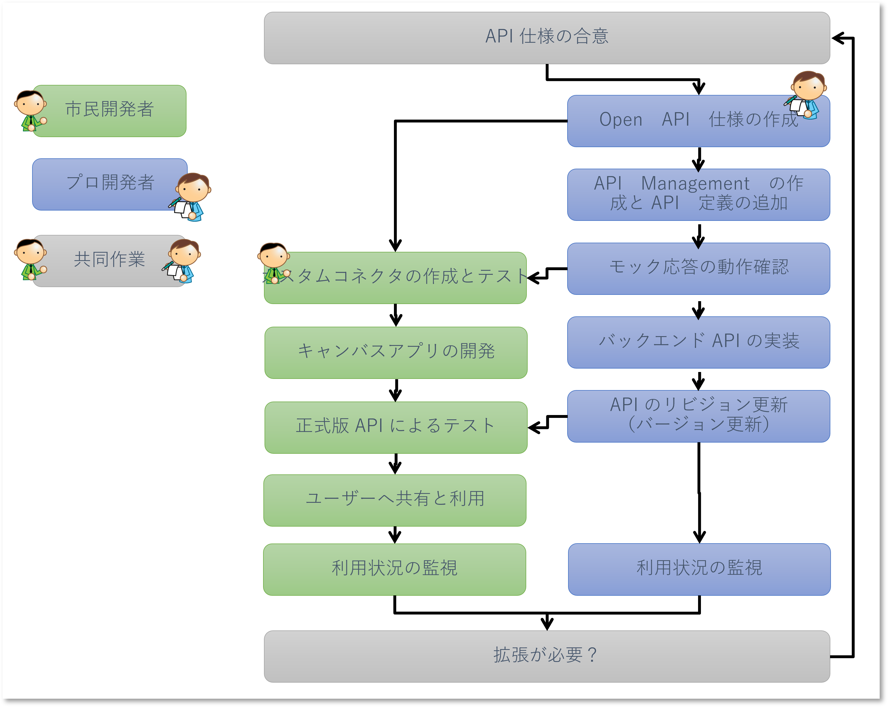

# Fusion 開発ハンズオン概要

本ハンズオンは [こちらの Workshop](<PAxAzure Fusion Development v0.2.22.1216.pdf> ':ignore') の Module 3 を元に作成されています。
手順書の PDF 版は [こちら](handson.pdf ':ignore') をご利用ください。

## ハンズオンで構築する内容

本ハンズオンでは Power Apps キャンバスアプリから Azure API Managment を介して、Azure App Service 上でホストされたカスタム API を呼び出すアプリケーションを構築します。

## ハンズオンの作業フロー

ハンズオンでは下記のような構築作業を行います。各参加者が一連の作業を全て実施するため、実業務のような役割分担は行いません。

