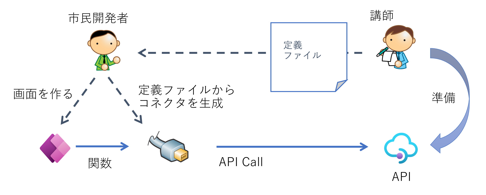

# Module 1 : Power Apps とカスタムコネクタ

## はじめに

このモジュールでは以下の内容を学習します。

- Web API を呼び出すためのカスタムコネクタを作成する
- キャンバスアプリからカスタムコネクタを呼び出す

## Web　API　情報の入手

このモジュールで呼び出す Web API は講師提供のものを使用しますので、下記を入手してください。

- Open API 定義ファイル
- Web API の URL

## カスタムコネクタの作成

まずブラウザで [https://make.powerapps.com/](https://make.powerapps.com/) を開き Power Apps にサインインします

