# Module 1 : Power Apps とカスタムコネクタ

## はじめに

このモジュールでは以下の内容を学習します。

- Web API を呼び出すためのカスタムコネクタを作成する
- キャンバスアプリからカスタムコネクタを呼び出す

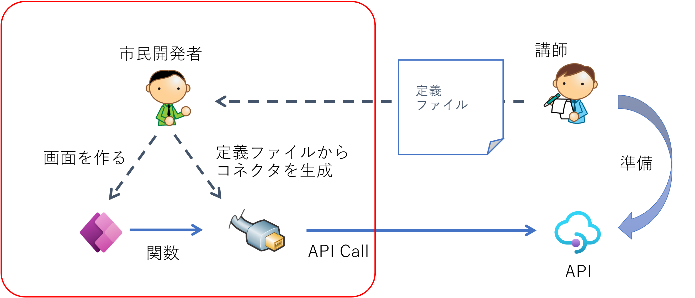


## Step 1 : Web API 情報の入手

このモジュールで呼び出す Web API は講師提供のものを使用しますので、下記を入手してください。

- Open API 定義ファイル
- Web API の URL
- API キー

## Step 2 : カスタムコネクタの作成

ここでは講師がホストする API を呼び出すためのカスタムコネクタを作成します。

### 開発環境の選択

- ブラウザで [https://make.powerapps.com/](https://make.powerapps.com/) を開き Power Apps にサインインします。
- 右上の環境選択メニューから自分の名前の付いた環境を選択します

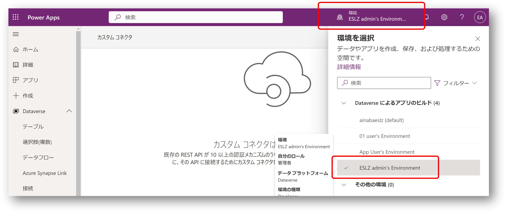


### OpenAPI ファイルからカスタムコネクタを作成する

- 左のメニューで ```Dataverse ``` > ```カスタムコネクタを``` 選択します。
- 右上に表示される ```+ カスタムコネクタの新規作成``` を開き ```OpenAPI ファイルをインポートします``` を選択します。
- コネクタ名に ```TodoApi_v1 ``` と入力、講師から提供された OpenAPI 定義ファイルを ```インポート``` します。
- ```続行``` をクリックします。

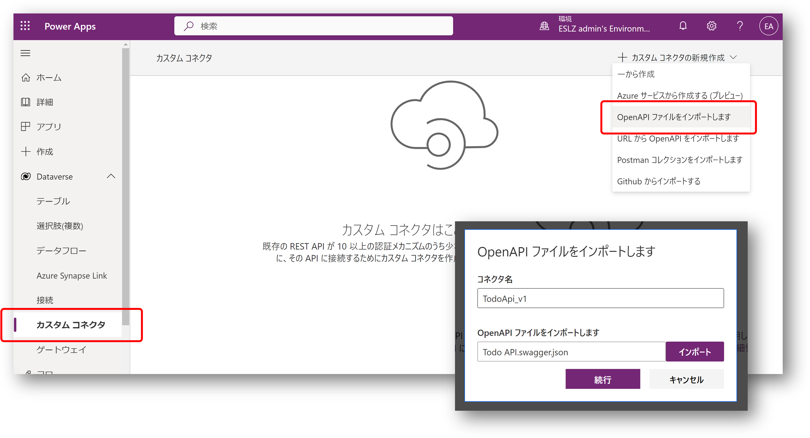

- 全般、セキュリティ、定義、コード タブでは何も入力せずに、```テスト``` タブまで進みます。
- ```コネクタの作成``` を選択します

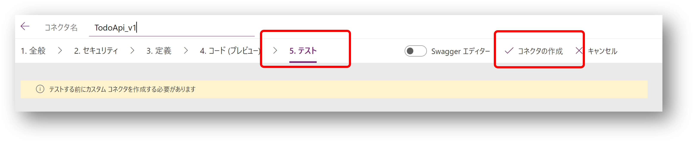

- コネクタが保存されたら ```新しい接続``` を選択します。
- ```API キー``` 欄に講師から入手したキー情報を入力します
- ```作成``` を選択します

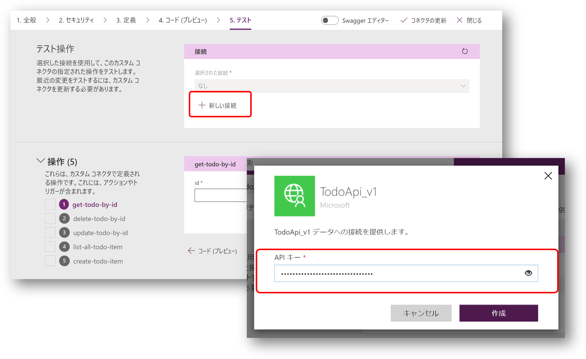

- ```接続``` の一覧画面では、先ほど作成したコネクタと同じ ``` TodoAPI_v1 ``` という名前の接続が出来ていることが分かります
- もう一度 ```カスタムコネクタ``` メニューを選択します。
- ```TodoApi_v1``` コネクタを編集します

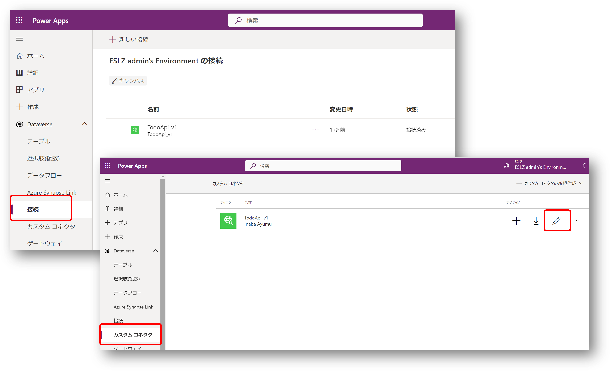


- ```テスト``` タブまで画面を進めます
- 先ほど作成した ```接続``` を選択します
- ```list-all-todo-item``` 操作を選択します
- ```テスト操作``` を選択します

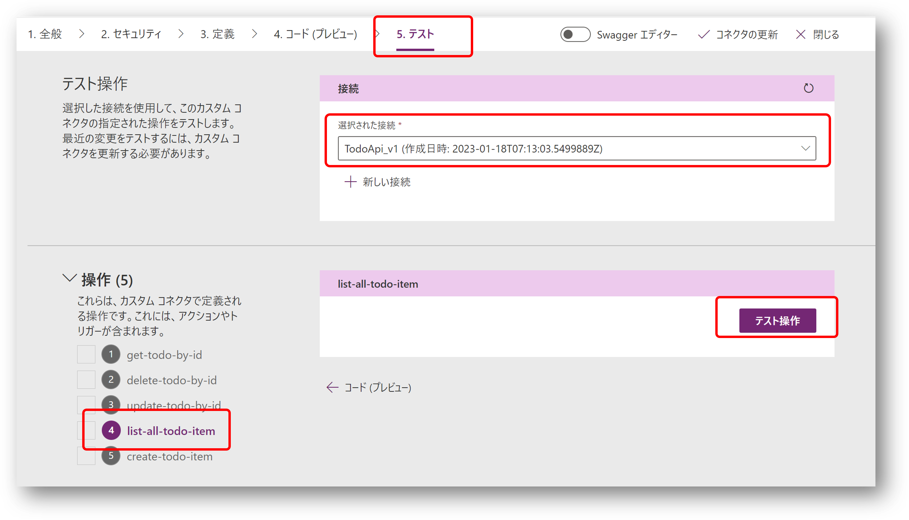

- 状態コード ```200``` が帰ってくれば成功です
- ```ボディ``` 欄に Todo の一覧が返却されていることを確認します

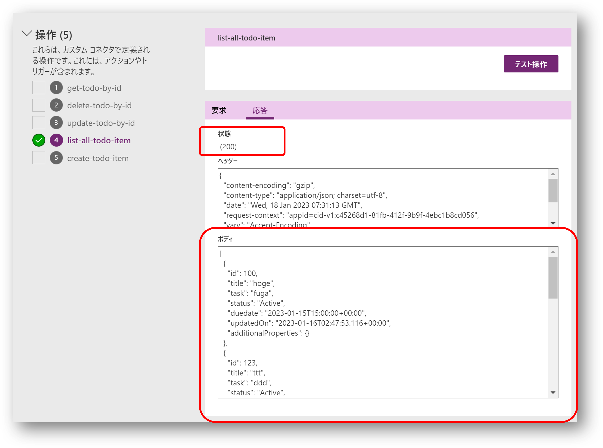


## Step 3 : キャンバスアプリの作成

ここでは作成したコネクタを利用して、Todo を管理する Power Apps キャンバスアプリを作成します

### キャンバスアプリの新規作成

- ```アプリ``` メニューを開きます
- ```新しいアプリ``` から ```キャンバス``` を選択します
- ```アプリ名``` を入力します
- ```作成``` を選択します

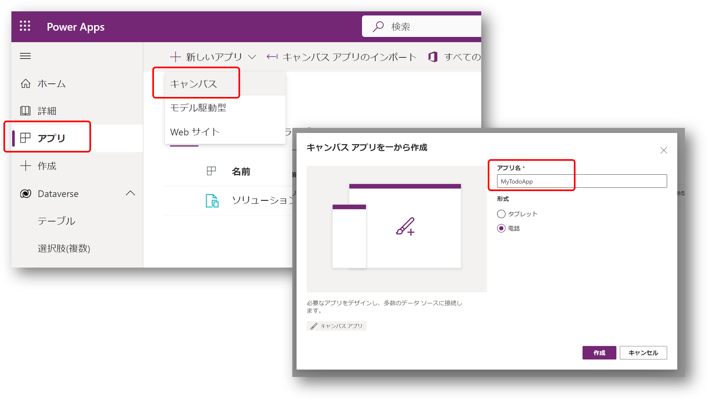

### 一覧画面の作成

- ```挿入``` メニューを選択します
- Todo 一覧を表示するための```垂直ギャラリー```を追加します
    - ```レイアウト``` プロパティで ```タイトルとサブタイトル``` を選択します
- データを取得するための ```ボタン```を追加します
    - ```テキスト``` プロパティに ```更新``` と入力します

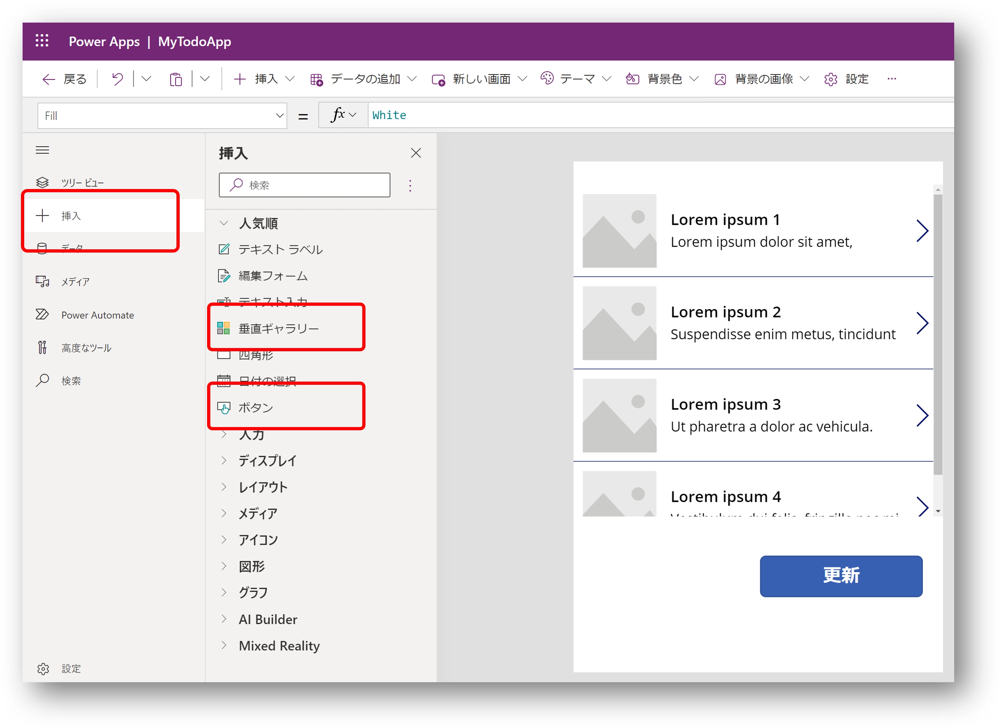

- ```データ``` メニューを選択します
- ```データの追加``` を選択します
- 作成済みの ```TodoAPI_v1``` コネクタを検索して選択します
- 作成済みの ```TodoAPI_v1``` 接続を選択します

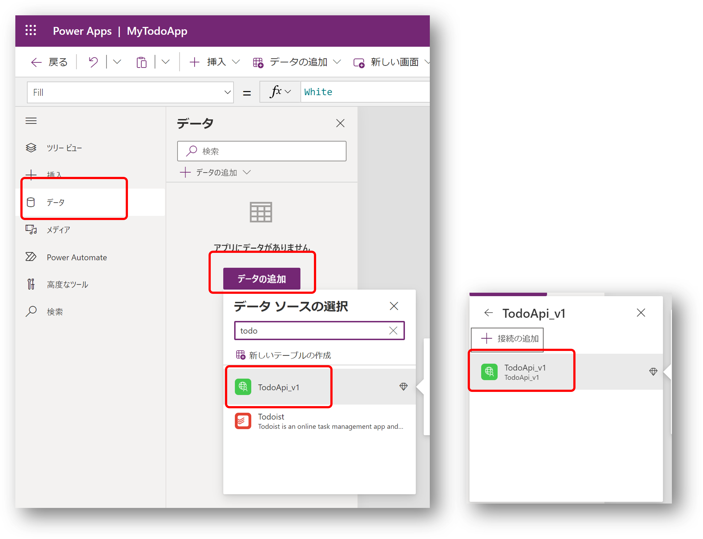

- 更新ボタンの ```OnSelect``` 時に ```TodoApi.listalltodoitem``` の呼出し結果を ```todolist``` コレクションに設定します
- 垂直ギャラリーの ```Items``` プロパティに ```todolist``` コレクションを設定します

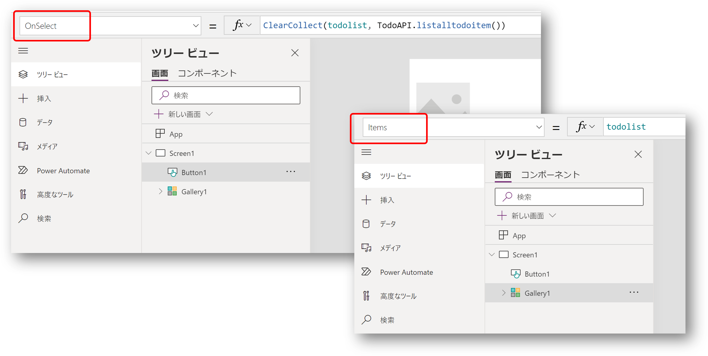

- ```Alt``` キーを押しながら更新ボタンをクリックするとコネクタが呼び出され、ギャラリーにデータが反映されます
- 垂直ギャラリーの ```フィールド``` メニューを編集します
    - ```Title``` フィールド に対して ```title``` を設定します
    - ```Subtitle``` フィールドに対して ```task``` を設定します
- もう一度 ```Alt``` キーを押しながら更新ボタンをクリックするとコネクタが呼び出され、意図した項目が表示されるようになります

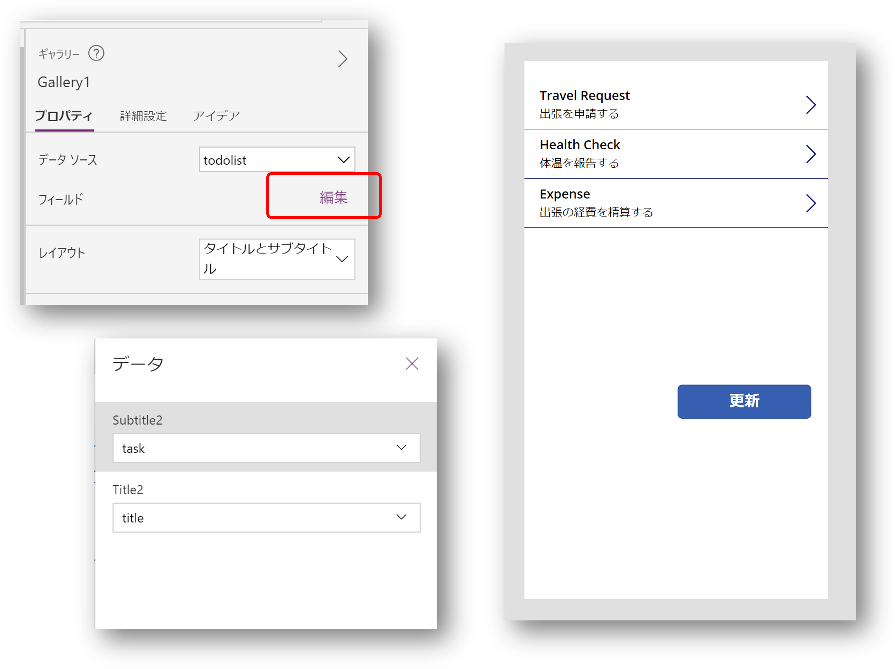

### 新規登録画面の作成

- アプリに ```新しい画面``` を追加します（Screen2 が追加されます）
- 更新ボタンの隣に新しく ```ボタン``` を追加します
    - ```テキスト``` プロパティに ```新規``` と入力します
    - ```OnSelect``` 時に ```Screen2``` に画面遷移します

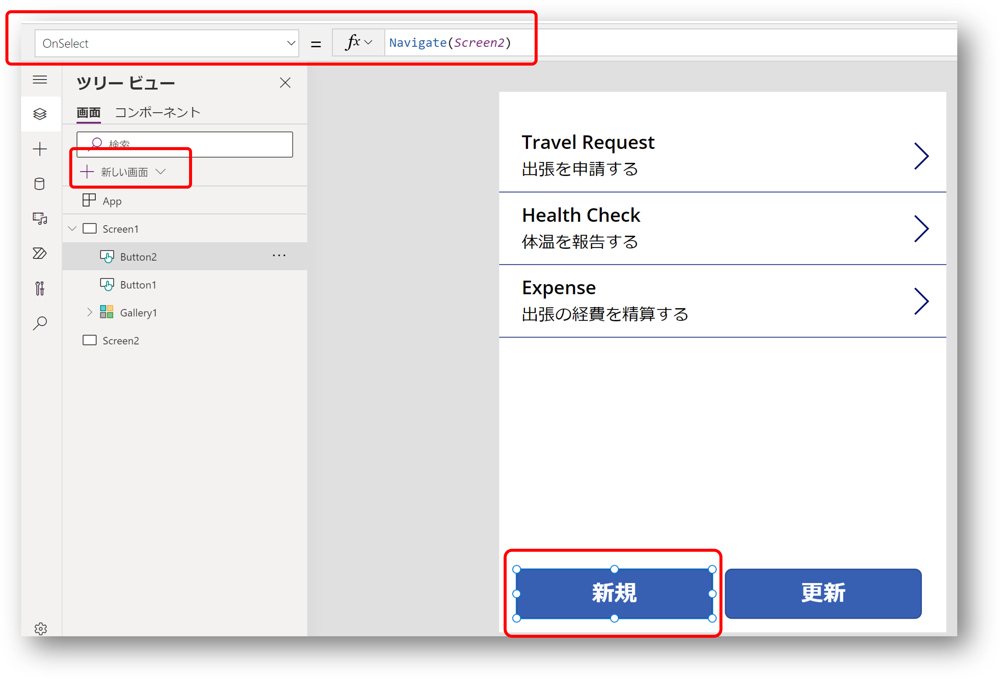

- ```Screen2``` を表示します
- 以下の項目を追加します。

|名前|コントロール|プロパティ|値|
|---|---|---|---|
|NewIdInput|TextInput|書式|数値|
|||ヒントのテキスト|重複しない数字を入力してください|
|NewTitleInput|TextInput|書式|テキスト|
|||ヒントのテキスト|タスクの名前を入力してください|
|NewTaskInput|TextInput|書式|テキスト|
|||ヒントのテキスト|タスクの内容を具体的に入力してください|
|SaveButton|Button|テキスト|登録|
|||OnSelect|下記の式を設定|

```
TodoAPI.createtodoitem(
    {id:NewIdInput.Text, title:NewTitleInput.Text, task:NewTaskInput, 
    status: "Active", duedate: DateAdd(Now(), 7, Days), updatedOn: Now()});
Navigate(Screen1)
```

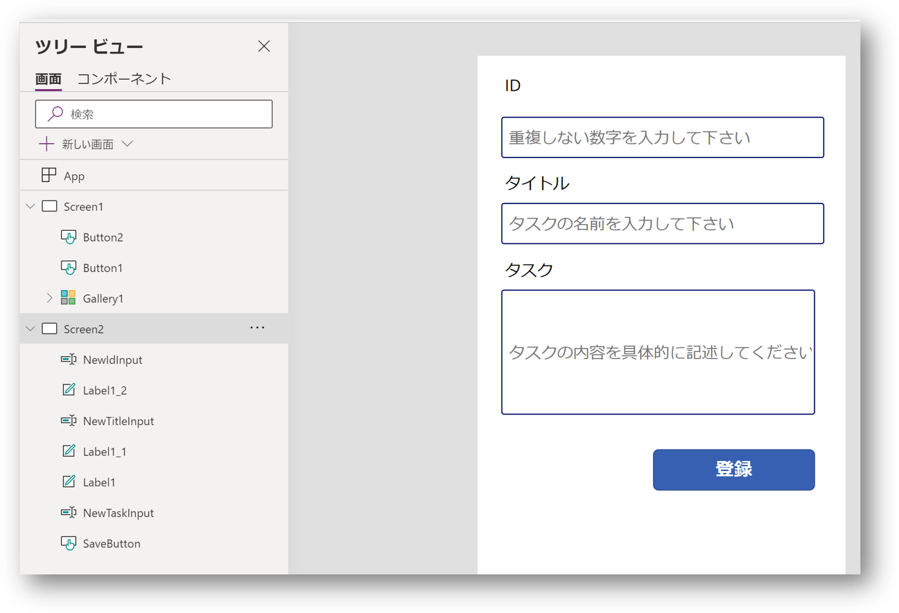

### 作成したアプリをテストする

- ```Screen1``` を表示します
- ```アプリのプレビュー``` を選択します
- 以下の作業を実施して動作を確認します

|操作|期待される結果|
|---|---|
|-|一覧画面(```Screen1```)が表示される|
|```更新```ボタンを選択|ギャラリーの内容が最新の情報に更新される|
|```新規```ボタンを選択|新規登録画面(```Screen2```)が表示される|
|```ID```に適当な数字を入力|-|
|```タイトル```に適当な文字列を入力|-|
|```タスク```に適当な文字列を入力|-|
|```登録ボタン```を選択|一覧画面(```Screen1```)が表示される|
|```更新```ボタンを選択|追加したタスクが表示される|


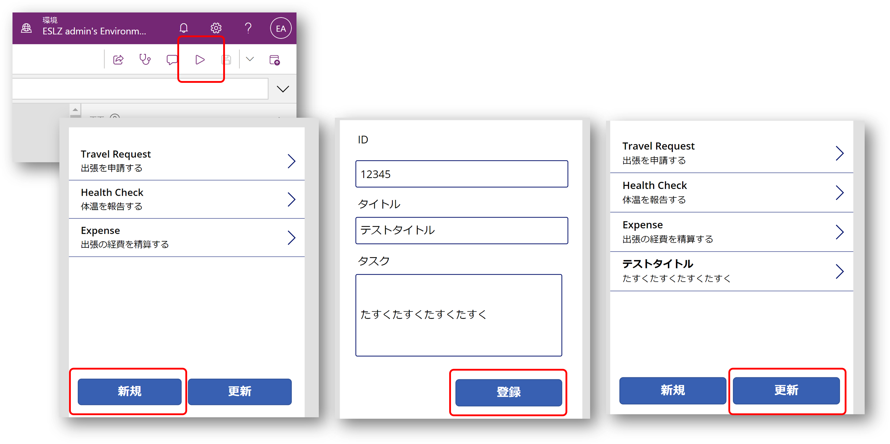


## Step 4 : 応用編

作業時間に余裕がある場合は、下記に挑戦してみましょう。
作成手順は自身で考えてみてください。

- カスタムコネクタで利用可能な他の操作を確認する
- 期日やステータスなどを表示するための詳細表示画面を作成する
- 登録済みの Todo の内容を編集、あるいは削除を行う

## まとめ

このモジュールでは既に作成・提供されている Web API をキャンバスアプリから呼び出すことが出来ました。
