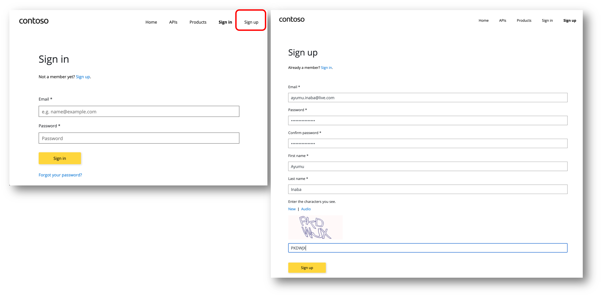
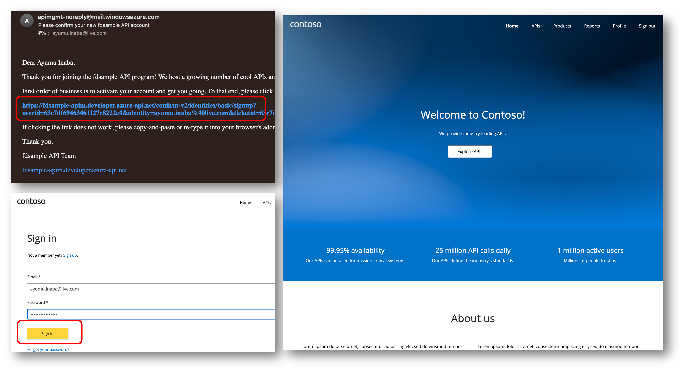
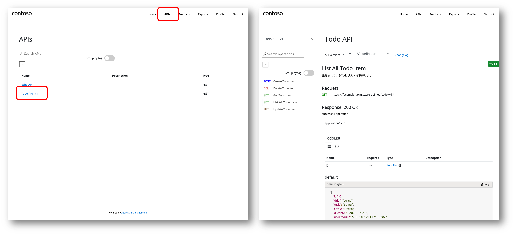
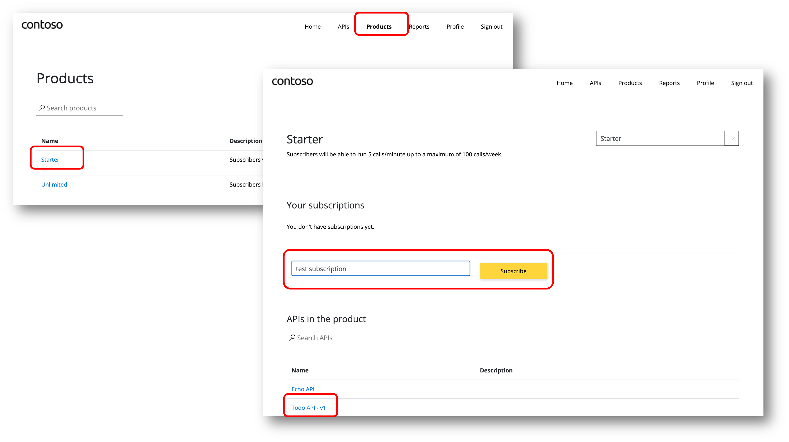
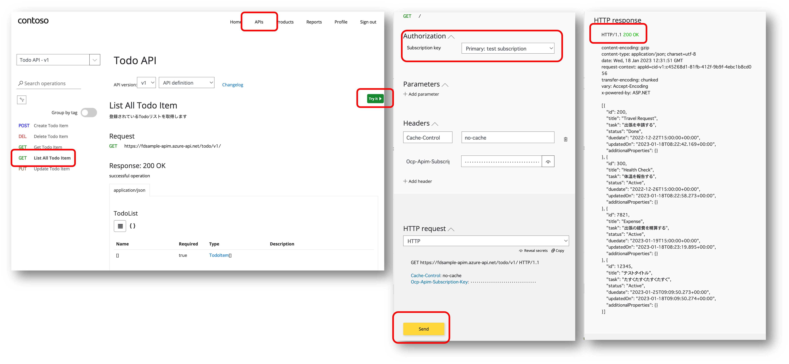
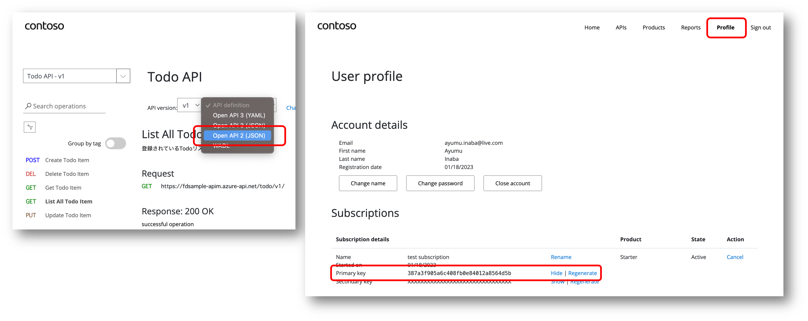
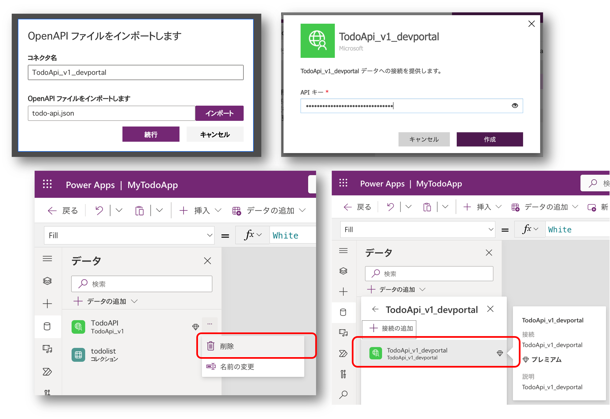

# Module 2 : 市民開発者のセルフサービス開発

## はじめに

このモジュールでは以下の内容を学習します。

- Azure API Management 開発者ポータルを利用して必要な API 情報を入手する

## Step 1 : 必要な情報の入手

API Management は講師提供のものを利用しますので、参加者は自身で用意する必要はありません。
開発者ポータルの URL を講師から入手して、ハンズオンを開始してください。

例）https://_[apiManagementName]_.developer.azure-api.net/

## Step 2 : サインアップ

ここでは新しい「市民開発者」が利用可能な API の情報を探すために、開発者ポータルへのサインアップ（アカウントの作成）を行います。

- ブラウザで開発者ポータルを開きます
- 画面右上の `Sign up` を選択します
- ユーザー情報を使用して `Sign Up` します

- 入力したメールアドレスのメールボックスを開きます
- Confirmation メール内に記載された URL を開きます
- メールアドレスおよびパスワードを入力し `Sign in` します
- 開発者ポータルが開きます

## Step 3 : API の発見と試用

ここでは開発者ポータルを利用して、利用可能な API を市民開発者自身で発見、その詳細を確認する方法を学びます。

- 画面右上の `APIs` を選択します
- API の一覧の中から `Todo API - v1` を選択します
- 各 Operation を選択し、API が提供する機能を確認します

- 画面右上の `Producs` を選択します
- `Starter` を選択します
- `Todo API - v1` が含まれていることを確認します
- サブスクリプション名を入力し `Subscribe` を選択します
- `User Profile` 画面で `Primary Key` が表示できることを確認します。

- もう一度 `Todo API - v1` の画面を表示します
- `List All Todo Items` を選択します
- `Try it` を選択します
- `Subscription key` で先ほど作成したサブスクリプションを選択します
- `Send` ボタンを選択します
- `HTTP/1.1 200 Ok` が表示され、Todo 一覧のデータが表示されることを確認します

## Step 4 : カスタムコネクタとアプリの開発

ここでは先ほど発見した API を呼び出すためのカスタムコネクタを作成します。

### Open API 定義ファイルを入手する

- `API definition` をドロップダウンします
- `Open API 2 (JSON)` を選択し、Open API 定義ファイルをダウンロードします
- `Profile` 画面を表示します
- `Primary Key` を表示（`Show`）し、値を控えておきます。

### カスタムコネクタとキャンバスアプリの開発

ここで実施する内容は [Module 0](./module00.md) とほぼ同じであるため詳細な手順を割愛します。

- ダウンロードした Open API 定義ファイルを使用してカスタムコネクタを作成します
- 控えておいた API Key を使用してカスタムコネクタの接続を作成します
- Module 0 で作成したキャンバスアプリの接続を削除します
- ここで作成したカスタムコネクタおよび接続を使用するようにアプリを修正します

