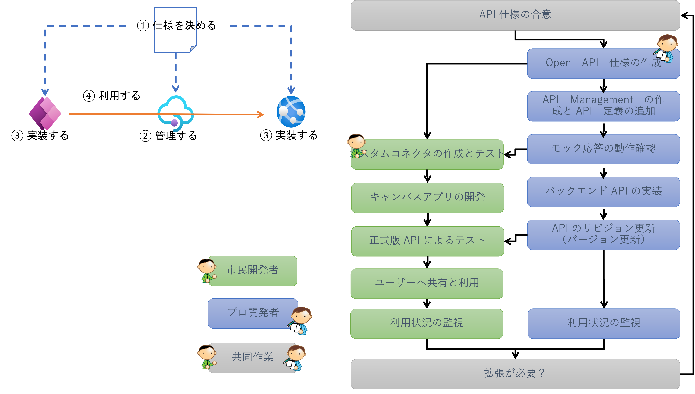
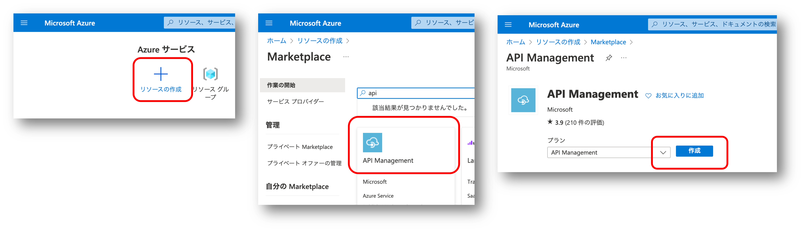

# Module 3 : アプリと API の開発プロセス

## はじめに

このモジュールでは以下を学習します。

- Power App x API Management x Azure App Service を使用した API のコントラクトファースト開発
- API Management を使用した API 使用の定義
- Azure App Service による バックエンド API の実装



## Step 0 : API Management の作成

このモジュールでは API Management を使用します。
ハンズオン参加者全員がアクセス可能な Azure サブスクリプションに 共有の API Management インスタンスを１つ作成します。
デプロイには一時間弱かかるため、時間に余裕を持って作成しておくことをお勧めします。
この作業は代表者１名で実施してください。

- ブラウザで Azure Portal (https://portal.azure.com) を開きます。
- `リソースの作成` を選択します
- `API Management` を検索して選択します
- `作成` を選択します




## Step 1 : API 仕様を決定する

これまでの Module で実装してきた Todo API の仕様を改めて定義します。

まず Todo のスキーマを確認します

```

```

