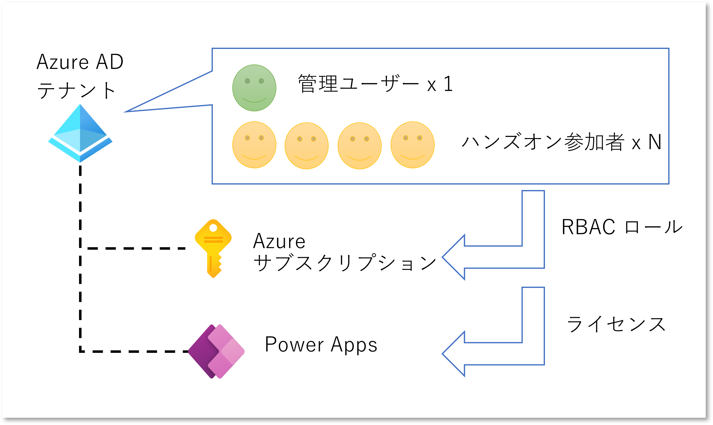
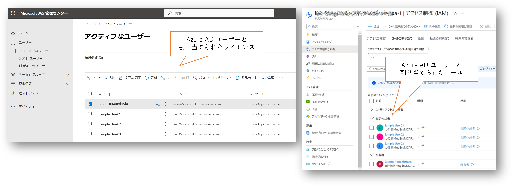

# Section 0 : ハンズオンの環境確認

## ハンズオン環境

ハンズオンを実施するためには下記の環境が必要になります。

- Azure Active Directory テナント
    - ハンズオン参加者の人数分のユーザー
    - ユーザーの登録・管理権限を持った管理ユーザー
- 上記テナントに関連付けられた Azure サブスクリプション
    - 管理ユーザーはサブスクリプションの所有者（Owner）ロールに割り当てる
    - ハンズオン参加者はサブスクリプションの共同作成者（Contributor）ロールに割り当てる
    - 無償評価版等も可
- 上記テナントに関連付けられた Power Apps
    - 管理ユーザーおよびハンズオン参加者ユーザーは Power Apps per user プランに割り当てる
    - 開発者プランや評価版でも可

各ユーザーへのライセンス割り当て状況は [Microsoft 365 管理センター](https://admin.microsoft.com/)で、Azure RBAC ロールの割り当て状況は [Azure ポータル](https://portal.azure.com) で確認出来る。

## Prefix の確認

本ハンズオンでは複数の参加者が共通のAzure サブスクリプションや PowerApps 環境を使用して作業を行います。
このため各参加者がユニークになる `Prefix` を決めておいてください。
自身の名前などをつけると分かりやすくなります。
ハンズオンの手順の中で `${Prefix}` の記載があった場合には、ここで決めた Prefix の文字列に読み替えて作業を行ってください。

