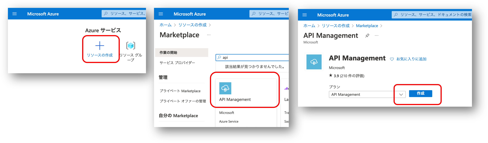
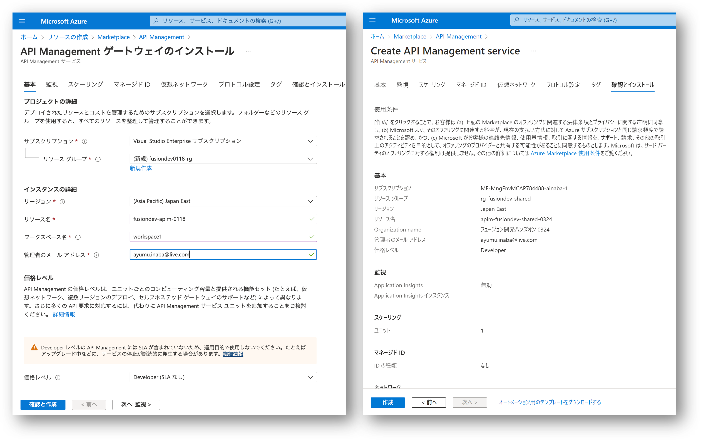

# Section 02 : Azure API Management の作成

この後で構築する API を管理するための Azure API Management を作成します。

**本セクションの作業内容は管理ユーザーが代表して 1 回だけ行ってください。**

## Azure サインイン

まず [Azure ポータル](https://portal.azure.com) を開きます。
必要に応じて管理者ユーザー名とパスワード等を使用してサインインしてください。

## API Management の作成

- `リソースの作成` をクリック
- `API` を検索し、`API Management` を選択
- `API Management` を作成

- `基本`タブ
    - リソースグループは `新規作成` を選択し `rg-fusiondev-shared` を入力
    - リージョンは `(Asia Pacific) Japan East` を選択
    - リソース名は `apim-fusiondev-shared-MMDD` を入力
        - MMDD はハンズオン実施日を指定してください
    - Orgnization name は `フュージョン開発ハンズオン MMDD` を入力
    - 管理者のメールアドレスを入力
    - 価格レベルは `Developer (SLA なし)` を選択
    - `次へ：監視` を選択
- `監視`タブでは特に何も入力せずに `次へ` を選択（画面キャプチャ省略）
- `スケーリング`タブでは特に何も入力せずに `次へ` を選択（画面キャプチャ省略）
- `マネージド ID`タブでは特に何も入力せずに `次へ` を選択（画面キャプチャ省略）
- `仮想ネットワーク`タブでは特に何も入力せずに `次へ` を選択（画面キャプチャ省略）
- `プロトコル設定`タブでは特に何も入力せずに `次へ` を選択（画面キャプチャ省略）
- `タグ`タブでは特に何も入力せずに `次へ` を選択（画面キャプチャ省略）
- `タグ`タブでは特に何も入力せずに `次へ` を選択（画面キャプチャ省略）
- `確認とインストール`タブ
    - `作成` を選択

`デプロイが進行中です` という画面が表示されたら完了までしばらく待ちます。

