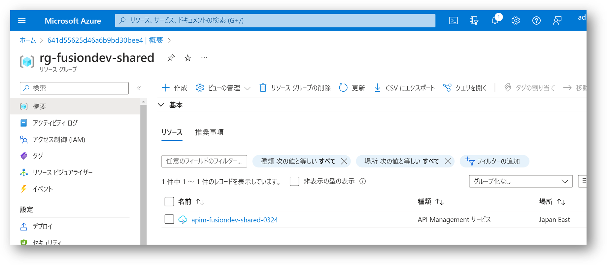
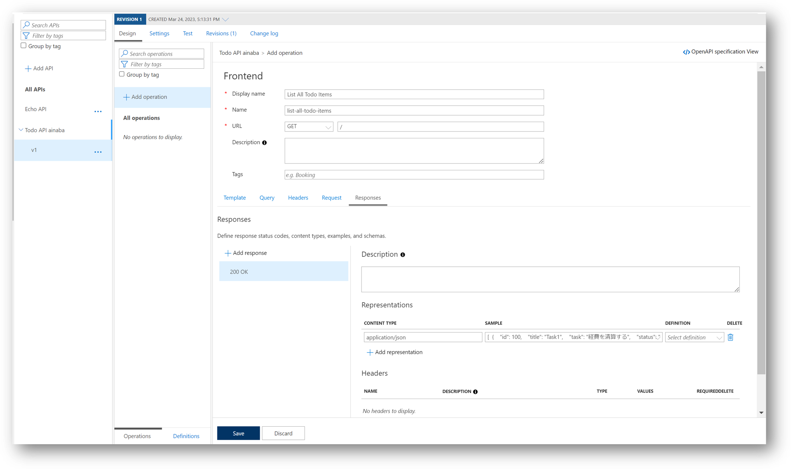
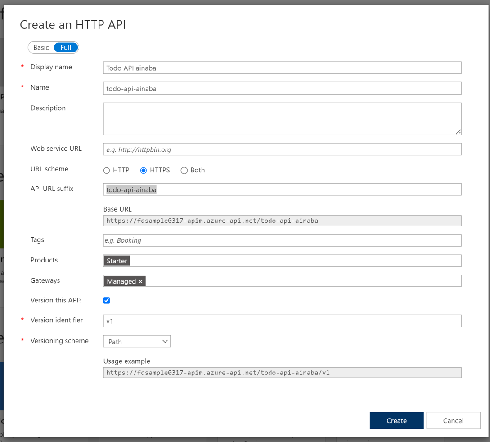
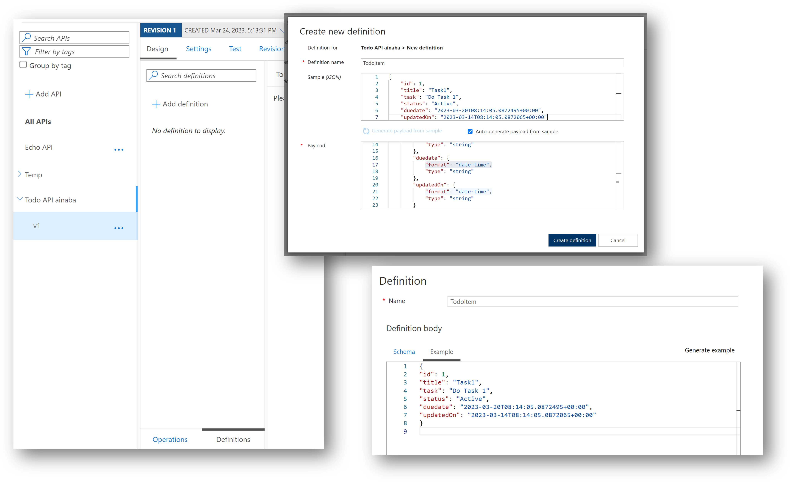
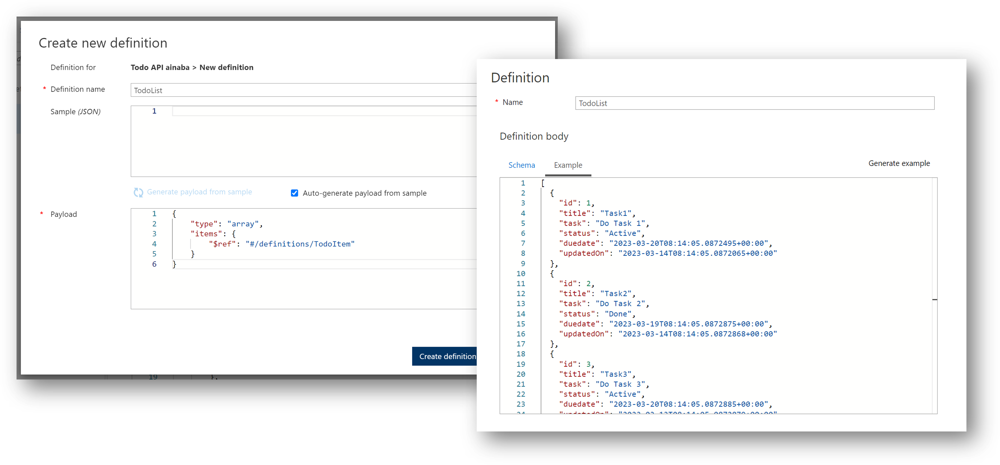
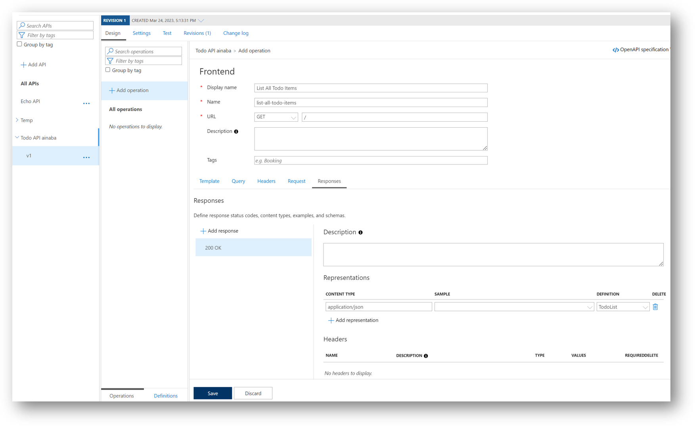

# Section 03 : Todo API の定義

!> 以降では共有の　API Management に対して、ハンズオン参加者が個別に API を定義していきます。
他の参加者が作成中の API を壊さないように注意してください。

## API Management の確認

ハンズオン参加者は各自に割り当てられたユーザーと初期パスワードを使用して [Azure ポータル](https://portal.azure.com) にサインインしてください。
初めてサインインするときには初期パスワードからの変更を求められますので、新しいパスワードを入力します。
設定した新しいパスワードを忘れないようにしてください。

- 画面左上のメニューから `リソースグループ` を選択
- 管理者が代表で作成した `rg-fusiondev-shared` という名前のリソースグループを選択
- 管理者が代表で作成した `apim-fusiondev-shared-MMDD` という名前の API Management を選択



## API の新規作成

- `API` メニューを選択
- `+ Add API` を選択
- `Define a new API` セクションの `HTTP` を選択



- Basic を `Full` に切替
- Display Name 欄に `Todo API ${Prefix}` を入力
- Name 欄が自動的に `todo-api-${prefix}` と入力される
- Web service URL 欄は空のまま入力しない
- URL scheme 欄は `HTTPS` を選択
- API URL suffix 欄に `todo-api-${prefix}` を入力
- Tags 欄は空のまま入力しない
- Products 欄は `Starter` を選択
- Gateways 欄は `Managed` が選択されているのでそのまま何もしない
- Version this API ? 欄を `チェック` する
- Version identifier 欄に `v1` を入力
- Versioning scheme 欄は `Path` を選択
- Usage example 欄が `https://apim-fusiondev-shared-MMDD.azure-api.net/todo-api-${prefix}/v1` となっていることを確認
- `Create` を選択



## Todo アイテム データ構造の定義

Todo アイテム１件分のデータ構造を定義します。

- 作成時に Display Name に入力した `Todo API ${prefix}` のバージョン `v1` が選択されていることを確認
- `Design` タブを選択
- `Definitions` に切替
- `+ Add definition` を選択
- Definition Name に `TodoItem` を入力
- Samle (JSON) 欄に下記のサンプルデータを入力

```json
{
"id": 1,
"title": "Task1",
"task": "Do Task 1",
"status": "Active",
"duedate": "2023-03-20T08:14:05.0872495+00:00",
"updatedOn": "2023-03-14T08:14:05.0872065+00:00"
}
```

- 自動生成された Payload 欄を修正
    - duedate プロパティに `"format": "date-time", ` を追加
    - updatedOn プロパティに `"format": "date-time", ` を追加
- `Create definition` を選択
- Example 欄に上記のサンプルデータを入力
- `Save` を選択



## Todo 一覧 データ構造の定義

Todo アイテム１件分のデータ構造を参照して、Todo 一覧のデータ構造を定義します。

- `+ Add definition` を選択
- Definition Name に `TodoList` を入力
- Samle (JSON) 欄は空のまま何も入力しない
- Payload 欄には下記を入力（OpenAPI 3.0 形式）

```json
{
    "type": "array",
    "items": {
        "$ref": "#/components/schemas/TodoItem"
    }
}
```

- `Create definition` を選択
- Example 欄に上記のサンプルデータを入力
- `Save` を選択

```json
[
  {
    "id": 1,
    "title": "Task1",
    "task": "Do Task 1",
    "status": "Active",
    "duedate": "2023-03-20T08:14:05.0872495+00:00",
    "updatedOn": "2023-03-14T08:14:05.0872065+00:00"
  },
  {
    "id": 2,
    "title": "Task2",
    "task": "Do Task 2",
    "status": "Done",
    "duedate": "2023-03-19T08:14:05.0872875+00:00",
    "updatedOn": "2023-03-14T08:14:05.0872868+00:00"
  },
  {
    "id": 3,
    "title": "Task3",
    "task": "Do Task 3",
    "status": "Active",
    "duedate": "2023-03-20T08:14:05.0872885+00:00",
    "updatedOn": "2023-03-13T08:14:05.0872879+00:00"
  }
]
```




## API 仕様の定義

ここでは Todo アイテムの一覧を取得する API 操作を作成します。

- 作成時に Display Name に入力した `Todo API ${prefix}` のバージョン `v1` が選択されていることを確認
- `Design` タブを選択
- `Operations` に切替
- `+ Add operation` を選択
- Display Name に `List All Todo Items` を入力
- Name は自動的に `list-all-doto-items` が入力される
- URL は `GET` を選択、パスはスラッシュ `/` のみを入力
- `Responses` タブを選択
- `+ Add response` では `200 OK` を選択
- `+ Add representation` では `application/json` を選択
- Sample 欄には上記の Todo 一覧のサンプルデータを入力
- DEFINITION 欄で `TodoList` を選択
- `Save` を選択



## 補足

ここでは単一の操作しか定義していませんが、後の手順で[Section 01](./section01.md)で設計したその他の操作も作成します。

