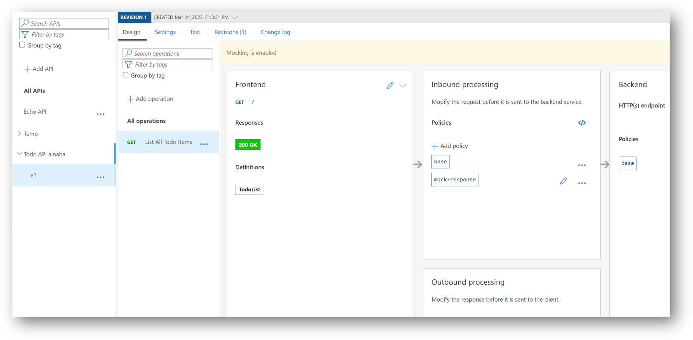
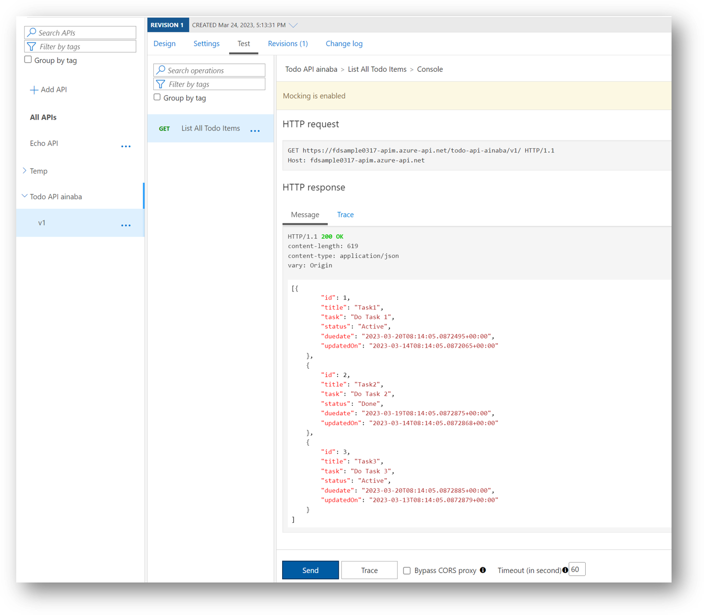

# Section 04 : モック応答の有効化とテスト実行

まだ API Management のバックエンドで動作する API を実装していませんので、このままでは API が動作しません。
API 実装には時間がかかるため、ここではモック応答を有効にしてダミーのデータを返すように構成しておくことで、
キャンバスアプリの開発に着手することが出来るようにしておきます。

## モック応答の有効化

- 先ほど作成した `List All Todo Items` が選択されていることを確認
- Inbound processing 欄で `+ Add policy` を選択
- `Mock responses` ポリシーを選択
- API Management response 欄で `200 OK, application/json` を選択
- `Save` を選択
- `Mocking is enabled` が表示されることを確認



## API のテスト実行

- モック応答を有効にした `List All Todo Items` を選択します
- `Test` タブに切り替え
- `Send` ボタンをクリックすると、サンプルデータが返却されることを確認



## 補足

テスト実行結果画面に表示されているように、下記の URL に対する HTTP GET 操作で Todo アイテムの一覧を取得することが出来ました。

```
https://apim-fusiondev-shared-MMDD.azure-api.net/todo-api-${prefix}/v1/
```

これは以下の要素の組み合わせになっていることが分かります。

|要素|値|説明|
|---|---|---|
|Host|apim-fusiondev-shared-MMDD|API Managemetn インスタンス単位（共有）|
|API|todo-api-${prefix}|API 定義を作成時に指定した API URL Suffix（ハンズオン参加者単位で作成）|
|Version|v1|API 定義を作成時に指定した Version Identifier|
|Method|GET|List All Todo Items 作成時に指定した HTTP GET|
|Path|/|List All Todo Items 作成時に指定したパス（ルート）|

API Managemetn インスタンスは共有していますが、バージョン単位で独立した API がホストされ、Method と Path で操作を切り替えていることになります。