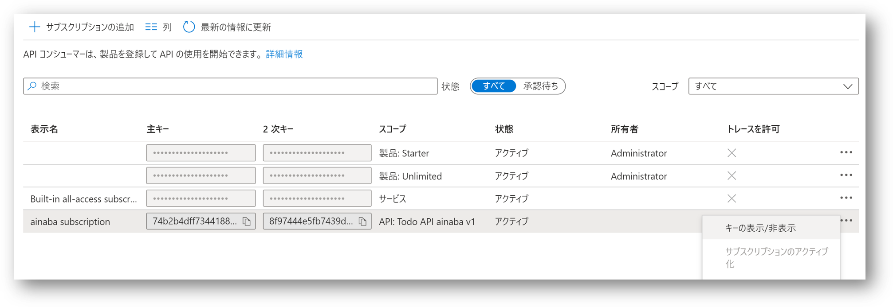

# Section 05 ： カスタムコネクタの作成

作成した Todo API を呼び出すためのカスタムコネクタを作成します。

## API 呼出し情報を取得

まず API の仕様書を入手します。

- 作成した `Todo API ${prefix} API` の `v1` を選択
- コンテキストメニュー（・・・）の `Export` を選択
- `OpenAPI v2 (JSON)` を選択、ローカルPCにダウンロードしておく

API を呼び出すためには共有キーを必要になりますので、そちらも取得します。

- API Manageent の `サブスクリプション` メニューを選択
- 製品: Starter スコープのサブスクリプションの一番右にあるメニュー（・・・）を選択
- `キーの表示/非表示` を選択してキーを表示
- `主キー` に表示され値をコピーして控えておく

## Power Apps にサインイン

ハンズオン参加者は各自に割り当てられたユーザーを使用して [Power Apps](https://make.powerapps.com/) にサインインしてください。

## カスタムコネクタ用のメニューの表示

初期状態では左側のメニューにカスタムコネクタが表示されていないため、表示するように設定します。

- `詳細`メニュー内の `すべて検出`を選択
- データ セクション内にある `カスタム コネクタ` と `接続` をピン止め

## カスタムコネクタの作成

- メニューに追加された `カスタム コネクタ` を選択
- Power Automate へようこそ画面が表示されたら `開始する` を選択
- `+ カスタム コネクタの新規作成` を選択
- `OpenAPI ファイルをインポートします` を選択
- コネクタ名には `TodoApi_${Prefix}_v1` と入力
- 先ほどダウンロードしておいた仕様書を `インポート` する
- `続行` を選択

- `全般` 画面は特に何も入力せず `セキュリティ →` を選択
- `セキュリティ`画面
    - 認証タイプは `API キー` を選択
    - `定義 →` を選択

- `定義`画面
    - アクションに `List All Todo Items` が定義されていることを確認
    - 参照に `TodoItem` と `TodoList` が定義されていることを確認
    - エラー等が表示されていないことを確認
    - `コネクタの作成` を選択
    - `カスタムコネクタが正常に作成されました` と表示されるまで待つ
- `コード（プレビュー）` 画面は特に何も入力せず `テスト →` を選択
- `テスト`画面
    - `+ 新しい接続` を選択
    - API キーに先ほど控えておいた `主キー` を入力
    - `作成` を選択

- `接続`メニューが選択されている状態になるため、`カスタム コネクタ` メニューを選択
- 作成したコネクタ `TodoApi_${prefix}_v1` を編集（鉛筆アイコン）
- `テスト`画面まで進める
- 選択された接続欄で先ほど作成した `接続` を選択
- list-all-todo-items の `テスト操作` を選択
- モック応答データが返却されることを確認
- `閉じる` を選択

