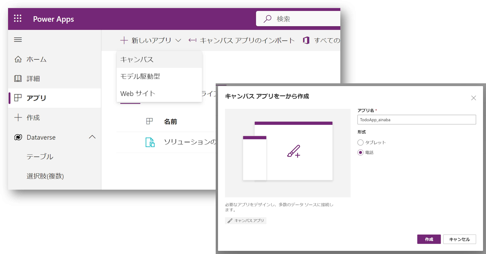
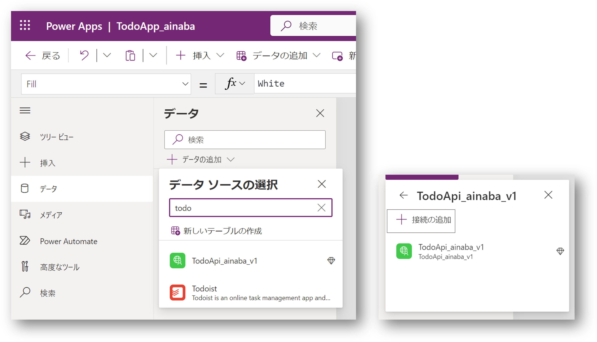
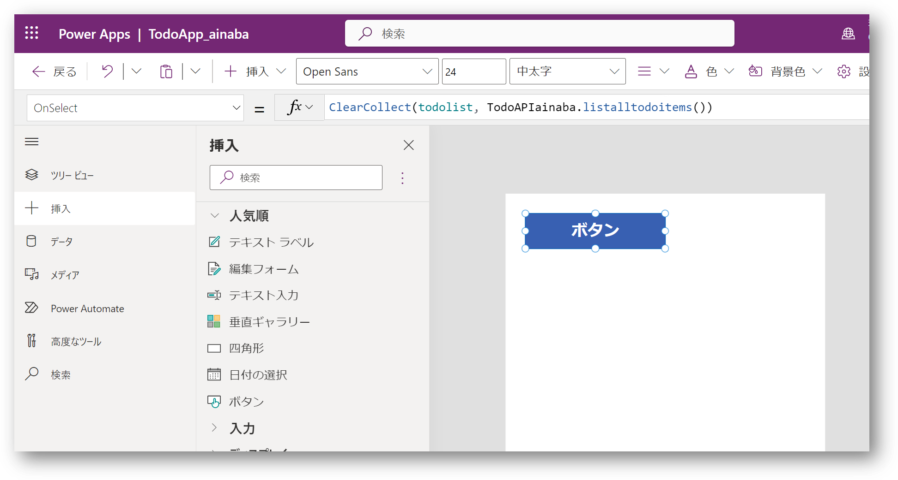
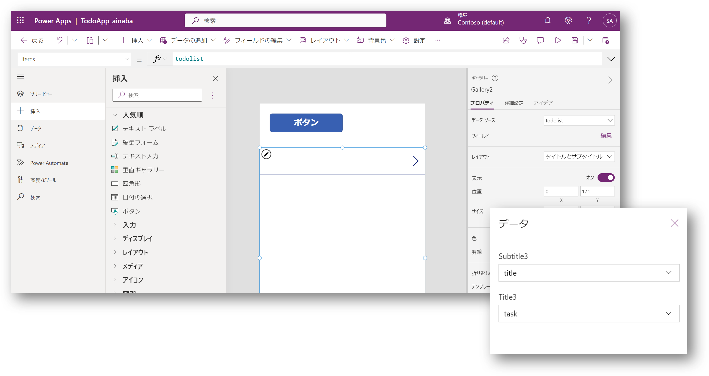
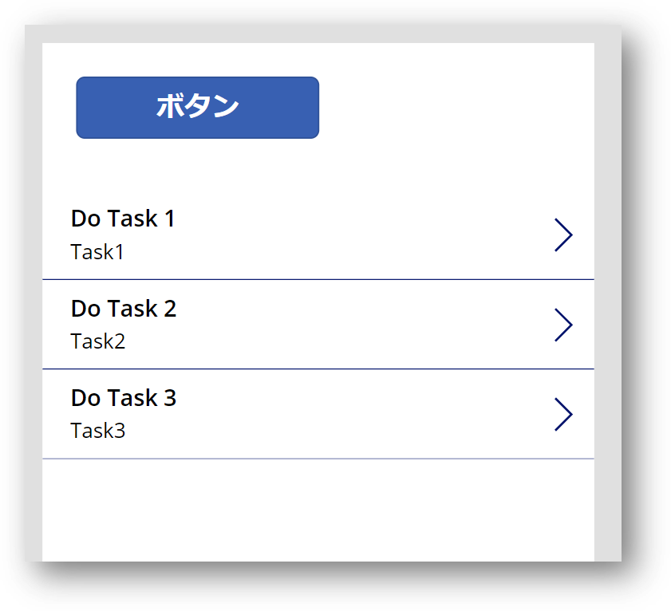

# Section 06 : キャンバスアプリの開発

カスタムコネクタおよび接続を利用して API を呼び出すキャンバスアプリを開発します。

## キャンバスアプリの新規作成

- `アプリ` メニューを選択
- `+ 新しいアプリ` から `キャンバス` を選択
- アプリ名に `TodoApp_${prefix}` を入力
- `作成` を選択



## データの追加

- `データ` メニューを開く
- `+ データの追加` を選択
- データソースの選択で `TodoApi_${prefix}_v1` を検索して選択
- 作成した接続を選択（既定ではコネクタと同名）



## Todo アイテム一覧を取得するボタン

- `挿入` メニューから `ボタン` を選択
- キャンバスに追加されたボタンを選択
- `OnSelect` イベントに下記の式を入力

```
ClearCollect(todolist, TodoAPIainaba.listalltodoitems())
```



このボタンを押下すると `todolist` という変数に API の呼出し結果が格納されます。

## 一覧表示用のギャラリー

- `挿入` メニューから `垂直ギャラリー` を選択
- キャンバスに追加された垂直ギャラリーを選択
- レイアウトで `タイトルとサブタイトル` を選択
- フィールドの `編集` を選択
- 表示するデータ項目として `title` と `task` を選択



## 動作確認

- ALT キーを押しながらボタンをクリック
- ギャラリーにモック応答が表示されることを確認

