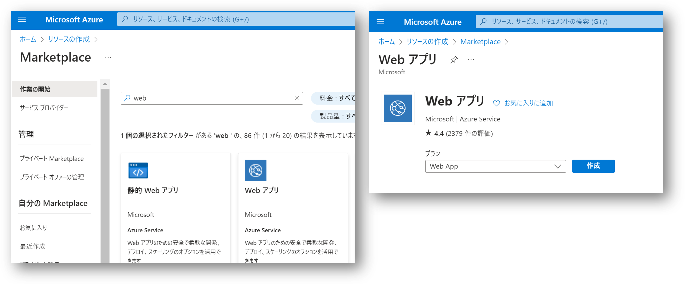
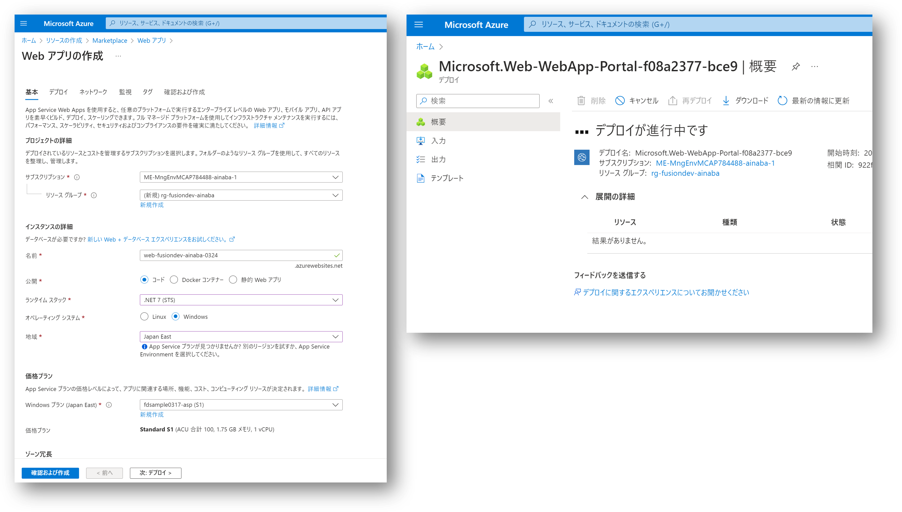
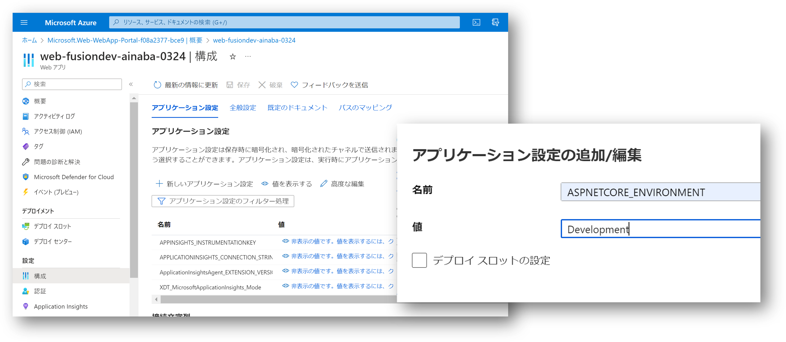
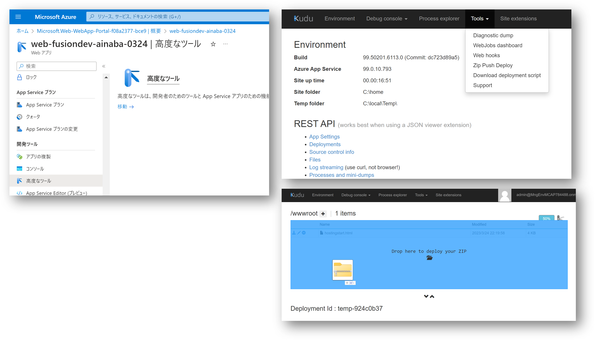
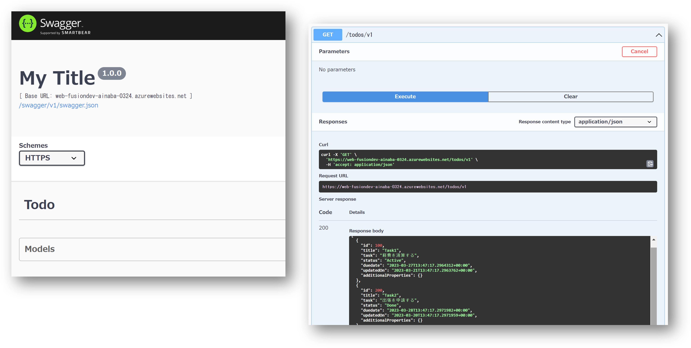

# Section 07 : バックエンド API の実装

今度は API Management で定義した API の使用を満たす実際の Todo API を実装します。
Azure Web Apps は参加者個別に作成します。

## 実装済み Todo API の取得

このハンズオンでは時間の関係から ASP.NET で実装済みのアプリケーションを Azure Web Apps 上にデプロイするのみとします。
サンプルアプリが保存されている[GitHub Release](https://github.com/ayuina/fusion-dev-sample/releases/tag/app-v4)を開き、Assets の中から `default.zip` を選択してローカル PC にダウンロードしておいてください。

## Azure へのサインイン

ハンズオン参加者は各自に割り当てられたユーザーを使用して [Azure ポータル](https://portal.azure.com) にサインインしてください。

## Web Apps の作成

- `リソースの作成` をクリック
- `Web アプリ` を検索し、`Web アプリ` を選択
- `Web アプリ` を作成



- リソースグループは新規作成を選択し、 `rg-fusiondev-${prefix}` と入力
- 名前には `web-fusiondev-${prefix}-MMDD` と入力
- ランタイムスタックは `.NET 7 (STS)` を選択
- オペレーティングシステムは `Windows` を選択
- 地域は `Japan East` を選択
- その他の選択肢は既定のままで `確認および作成`をクリック
- 確認および作成画面でエラーがないことを確認して `作成` ボタンをクリック
- デプロイの完了を待ちます（おおよそ 1 分程度）
 


- `リソースに移動` を選択して Web App の画面を開く
- `概要メニュー` を選択
- `参照` を選択して初期ページが参照できることを確認

## Todo API のデプロイ

- Web App の `構成` メニューを選択
- `+ 新しいアプリケーション設定` を選択
- 名前に `ASPNETCORE_ENVIRONMENT` を入力
- 値に `Development` を入力
- `OK` を選択して アプリケーション設定の追加と編集画面を閉じる
- 構成画面に戻ったら `保存` を選択



- Web App の `高度なツール` メニューを選択して `移動` をクリック
- Kudu サイトが開いたら `Tools` メニューから `Zip Push Deploy` を選択
- 初期ページ（hostingstart.html） が表示されているあたりに、ダウンロードしておいた `default.zip` をドラッグアンドドロップする



初期ページを開いているブラウザの URL 欄でパスに `/swagger` を追加して `Enter` キーを押下します。
URL 全体は以下のようになります。

```
https://web-fusiondev-${prefix}-MMDD.azurewebsites.net/swagger
```

Swagger の画面が開いたら動作確認を行います。

- `Todo` を選択して展開
- `GET /todos/v1` を選択して展開
- `Try it out` ボタンを選択
- `Execute` ボタンを選択
- レスポンスコード 200 で Todo アイテム一覧が返ってくることを確認



## 補足

このハンズオンでは API の実装に ASP.NET を採用していますが、他の言語で実装してももちろん構いません。
また API をホストするサービスが Azure Web Apps である必要もありません。
クラウドサービスが Azure である必要もありませんし、クラウドサービスである必要もありません。
重要なのは[Section 2](./section02.md)で合意した仕様を満たす API がネットワーク到達性のある場所で実行されていることです。

## 参考情報

実装済みアプリのオリジナルのソースコードは Assets の中から `Source code` を選択するとダウンロード出来ます。
本セクションの冒頭でダウンロードした zip ファイルには、このソースコードをビルド・発行したものが含まれています。
