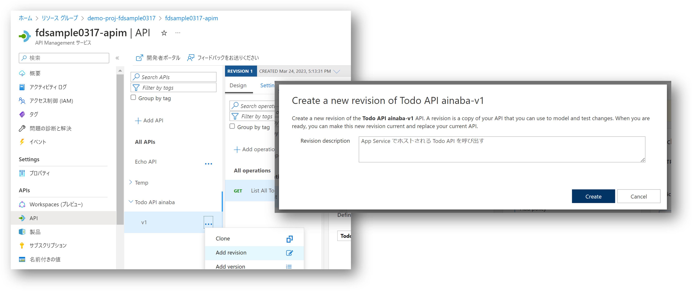
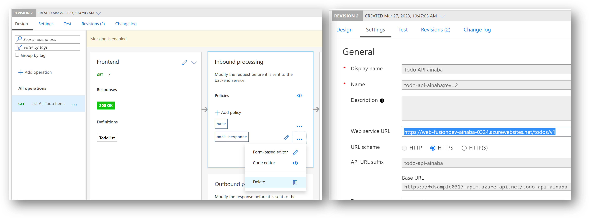
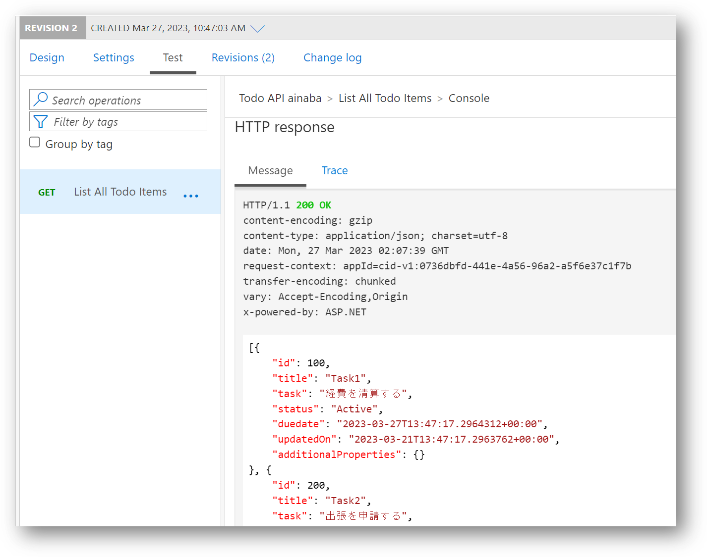
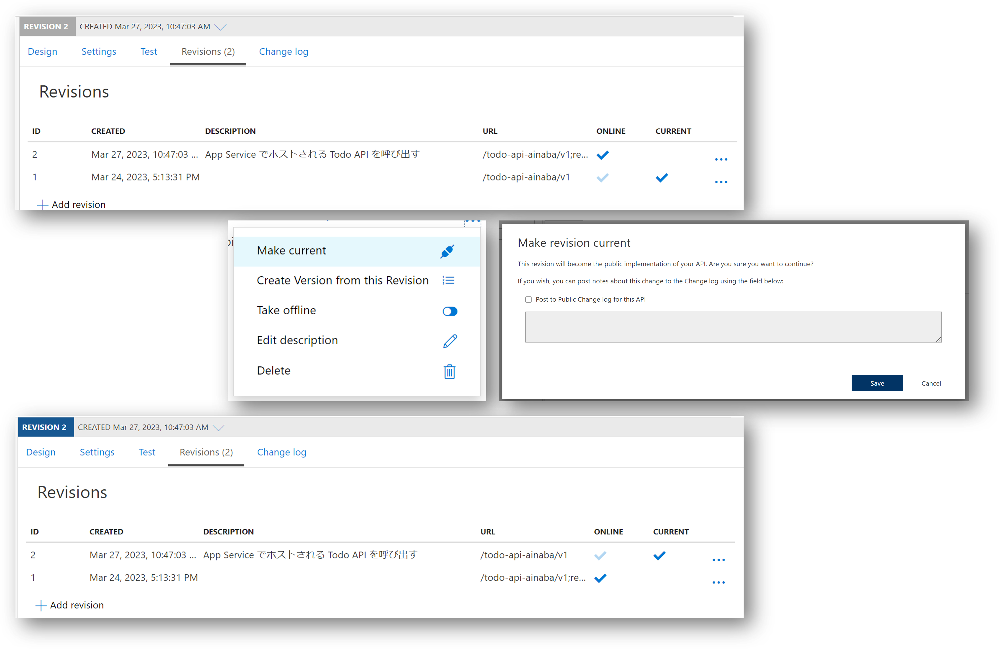

# Section 08 : API リビジョンの更新

API のバックエンド側が実装できましたので、API Management のモック応答を解除し、実際の Power Apps からの呼出しがバックエンド API を呼び出すように構成を変更します。

## 新規リビジョンの作成

現在の設定を書き換えるのではなく、構成変更後に問題があった場合にいつでも切り戻せるように、まずは新しいリビジョンを作成します。

- [Azure Portal](https://portal.azure.com)を開く
- リソースグループ `rg-fusiondev-shared` に含まれる API Management `apim-fusiondev-shared-MMDD` を開く
- 作成した `Todo API ${prefix} API` の `v1` を選択
- メニューから `Add revision` を選択
- Revision description にはこのリビジョンで変更のある内容を記述
- `Create` を選択



## 新規リビジョンの構成変更

新しく作ったリビジョン２はこれまでの設定（リビジョン１）の内容がコピーされているので、変更部分だけを修正します。

- グレーアウトされた REVISION 2 が表示されていることを確認
- `Design` を選択
- `List All Todo Items`を選択
- Inbound processing セクションに含まれる mock-response を `Delete` する
- `Save` を選択
- `Settings` を選択
- Web service URL に Section 07 でテスト実行した際の Request URL をコピー
- `Save` を選択



URL は以下のようになっているはずです。

```
https://web-fusiondev-${prefix}-MMDD.azurewebsites.net/todos/v1
```

## 新規リビジョンのテスト実行

リビジョン２ではバックエンド API が呼び出されることを確認します。

- グレーアウトされた REVISION 2 が表示されていることを確認
- `Test` を選択
- `List All Todo Items`を選択
- `Send` を選択
- モック応答ではなくバックエンド API からの応答(HTTP 200)が表示されることを確認



## 新規リビジョンを正式版に切り替え

- `Revisions` を選択
- Revisions の一覧に表示される Revision 2 の右端にあるメニュー（...） を選択
- `Make current` を選択
- Make revision current の画面で `Save` を選択
- 左上の REVISION 2 の背景が青くなっていることを確認
- Revisions の一覧に表示される Revision 2 の CURRENT にも チェックが入っていることを確認

