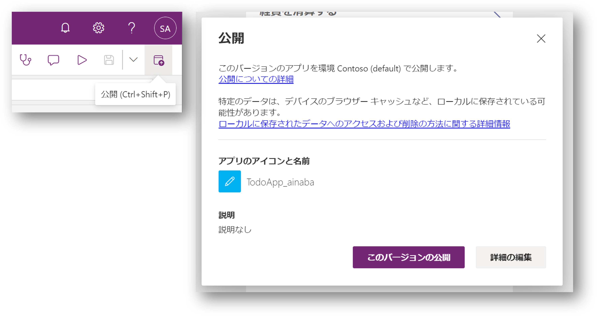
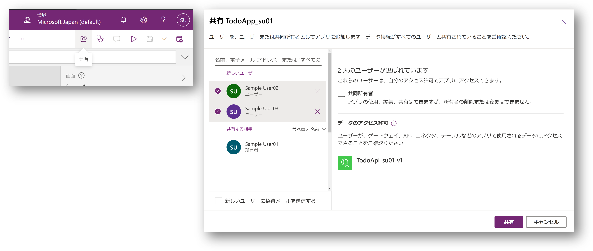
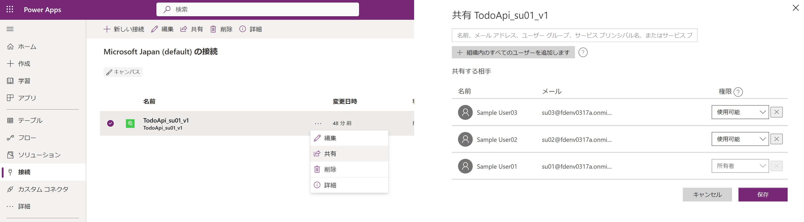
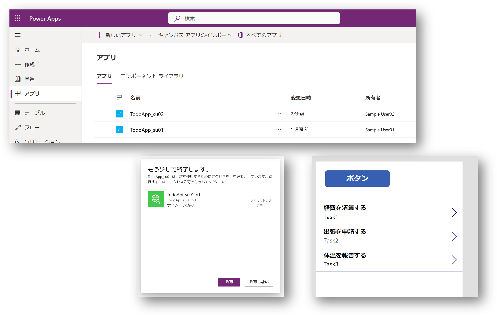

# Section 10 : キャンバスアプリの共有

ここでは作成したキャンバスアプリを別のユーザーに利用してもらいます。
近くの席のハンズオン参加者のユーザー名を教えてもらってください。

## キャンバスアプリの保存と公開

まず作成中のアプリを利用可能な状態にします。

- 画面右上の `公開` を選択
- `このバージョンの公開` を選択

## キャンバスアプリの共有

自分以外のユーザーが利用できるようにアプリを共有します。

- 画面右上の `共有` を選択
- 共有するユーザー（近くの席の参加者）名前を入力・選択
- 選択したユーザーの `共同所有者` のチェックが入って **いない** ことを確認
- データのアクセス許可にカスタムコネクタ名 `TodoApi_${prefix}_v1` が表示されていることを確認
- `新しいユーザーに招待メールを送信する` のチェックを外す
- `共有` ボタンを選択

## 接続の共有

キャンバスアプリとともにカスタムコネクタを共有しましたが、利用者は API キーを知らないと利用できません。
API キーは `接続` の作成時に入力していますので、この `接続` も共有します。

- 画面左側のメニュー内の `接続` を選択
- 作成済みの接続 `TodoApi_su01_v1` のメニューから `共有` を選択  
- アプリを共有したユーザー（近くの席の参加者）の名前を入力・選択
- 権限として `使用可能` が選択されていることを確認
- `保存` ボタンを選択

## 共有されたアプリの利用

ここの手順は自身が開発したアプリではなく、**他の参加者が開発し共有した** アプリで行います。

- 画面左側のメニュー内の `アプリ` を選択
- 共有されたアプリの名前部分をクリック
- アプリが起動する前に接続の利用を `許可` する
- アプリが表示されたら動作確認を行う

## 補足

上記の手順で `接続の共有` を行わなかった場合には、共有されたユーザーは API キーを入力する必要があります。
このような場合には「アプリの利用者はどのようにしてキーを入手するのか？」が問題になりますが、
ここではアプリとともに API キーが埋め込まれた接続も共有することで回避しています。
このため共有されたアプリを利用するだけであれば API キーを知っている必要はありません。

しかし、そもそも [Section 05](./section05.md) で各々が開発した API 固有のキーを発行して接続を作成、他のユーザーに共有しています。
これが可能なのは、このハンズオンでは「キャンバスアプリの開発者が API の開発者も兼ねている」ため、Azure ポータルから API キーを作成して利用することができる権限を持っているからです。
これは `フュージョン開発` という状況では現実的ではない可能性があります。
つまり「アプリの開発者はどのようにしてキーを入手するのか？」が問題になります。
この問題の解決策の１つとしては後述の API Management 開発者ポータルを利用する方法が考えられます。

あるいは（このハンズオンでは実施しませんが） API キーではなくユーザー認証を利用して API を保護する方法も考えられます。
この場合は Power Apps キャンバスアプリと同様に Azure AD ユーザー認証と OAuth 2.0 をベースとしたアクセス制御を実施することが可能です。

 