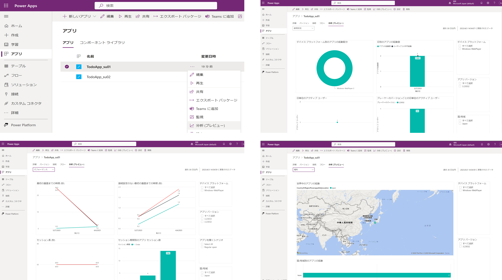
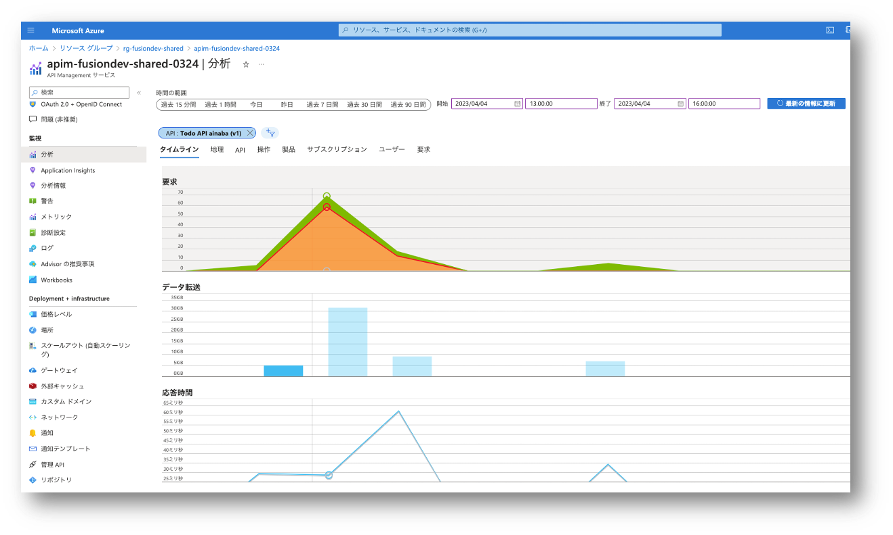
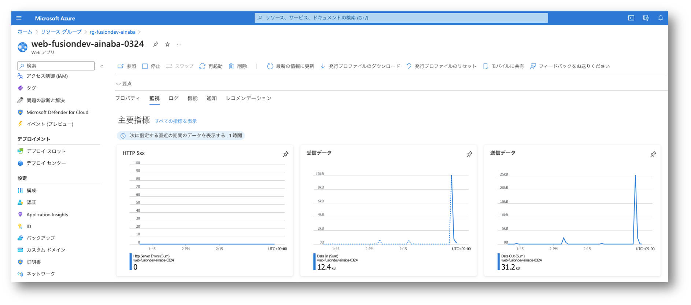
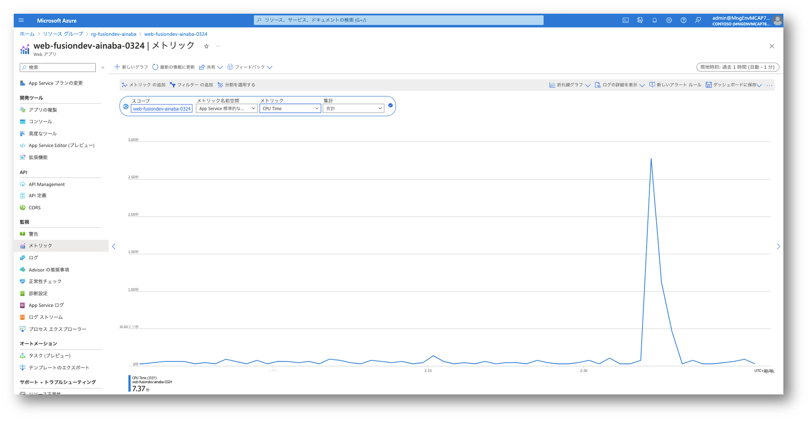

# Section 11 : アプリと API の利用状況の監視

開発したアプリや API の利用状況を監視することで、ユーザーのニーズやアプリの改善点を把握することができます。
また利用の芳しくないアプリや API を特定することで、サービスの廃止などの対応を行うことができます。
本セクションでは、キャンバスアプリと API の利用状況を監視する方法を紹介します。

## キャンバスアプリの利用状況の監視

!> **以下の内容は試験中やプレビュー段階の機能を含むため、今後変更になる可能性があります。**

開発・共有したキャンバスアプリの利用状況を確認します。

- Power Apps (https://make.powerapps.com) を開く
- 左側の `アプリ` メニューを選択
- 開発したアプリ `TodoApp_${prefix}` のメニューから分析（プレビュー）を選択
- ドロップダウンで `使用状況` を選択
- ドロップダウンで `パフォーマンス` を選択
- ドロップダウンで `場所` を選択

データの集計に時間がかかるためハンズオン作業中にはデータが表示されない可能性があります。
後日お時間のあるときに改めて確認してみてください。

## API の利用状況の確認

開発した API の利用状況を確認します。

- Azure Portal (https://portal.azure.com) を開く
- リソースグループ `rg-fusiondev-shared` を開く
- API Management `apim-fusiondev-shared-MMdd` を開く
- 左側のメニューから `分析` を選択
- 開始日時にハンズオンの開始日時を入力
- 終了日時としてハンズオンの終了予定日時を入力
- `最新の情報に更新` をクリック
- フィルターで `API` と `Todo Api ${prefix} (v1)` を選択
- `OK` を選択
- `タイムライン`、`地理`、`API` 等のタブを選択して呼び出し状況を確認

## バックエンド API の利用状況の監視

バックエンドで動作する API 実装をホストする App Services の利用状況を確認します。

- Azure Portal (https://portal.azure.com) を開く
- リソースグループ `rg-fusiondev-${prefix}` を開く
- App Service `web-fusiondev-${prefix}-MMdd` を開く
- 左側のメニューで `概要` を選択
- `監視` タブを選択
- HTTP 5xx のエラーや、送受信データ量、要求回数、応答時間などのグラフを確認

より詳細なメトリックデータを確認してみましょう。

- 左側のメニューで `メトリック` を選択
- スコープに `web-fusiondev-${prefix}-MMdd` を選択
- メトリック名前空間で `App Service 標準的なメトリック` を選択
- メトリック名で `CPU Time` や `Average memory working set` を選択

