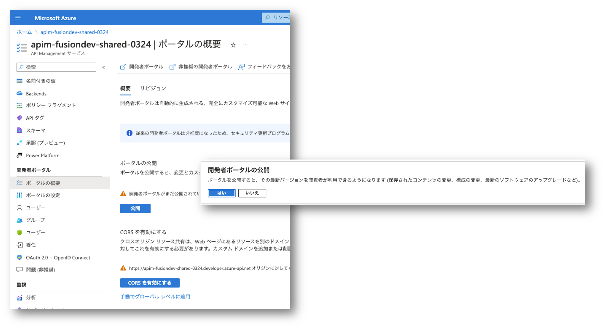

# Section 12 : 開発者ポータルの有効化

作成した API を多くの開発者に利用してもらうために、開発者ポータルを有効化します。

!> **本セクションの設定内容は代表者が 1 回だけ行ってください。**

## 開発者ポータルの有効化

既定の設定では開発者ポータルが無効になっていますので有効化する作業を行います。

- Azure Portal を開く
- リソースグループ `rg-fusiondev-shared` を選択
- API Management `apim-fusiondev-shared-MMDD` を選択
- 左のメニューから `ポータルの概要` を選択
- 上部のメニューから `開発者ポータル` を選択
- 別のタブで開発者ポータルの編集画面が表示される

## 開発者ポータルの公開

- Azure Portal に戻る
- `公開` ボタンが選択可能になっているのでクリック
- 「開発者ポータルの公開」が表示されたら `はい` を選択

## CORS の有効化

開発者ポータルから API を呼び出すためには、CORS の設定が必要です。

- `CORS を有効にする` ボタンが選択可能になっているのでクリック
- 「API に対して CORS を有効にする」が表示されたら `はい` を選択

## 開発者ポータル以外のクライアントの許可

上記で設定された CORS ポリシーでは、開発者ポータルからのみ API を呼び出すことができます。
Power Apps キャンバスアプリから呼び出せなくなってしまっているので、その他のクライアントも許可します。

- 左のメニューから `API` を選択
- 太字になっている `All APIs` を選択
- Allowed origins に入力されている値を削除して アスタリスク `*` を入力
- Allow credntials を `No` に切り替え
- `Save` を選択

