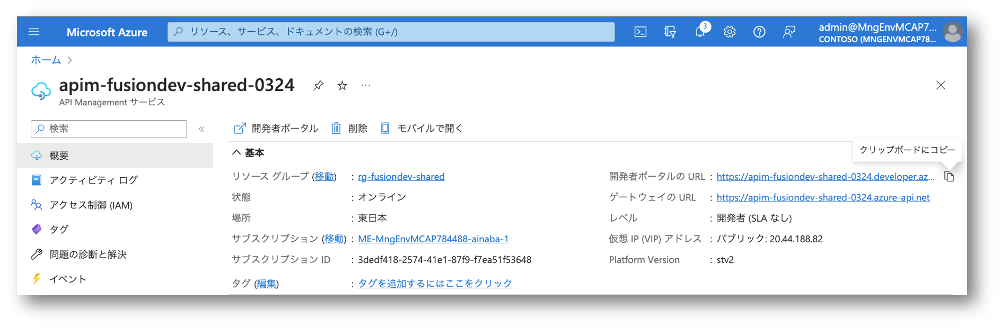
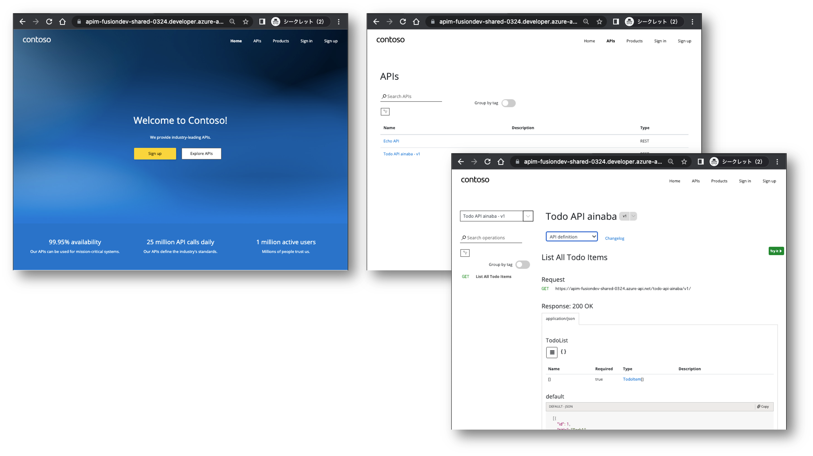
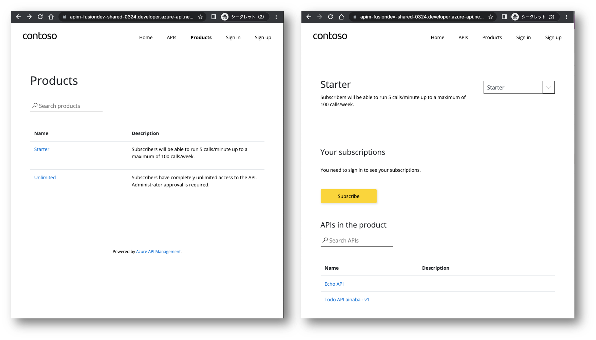
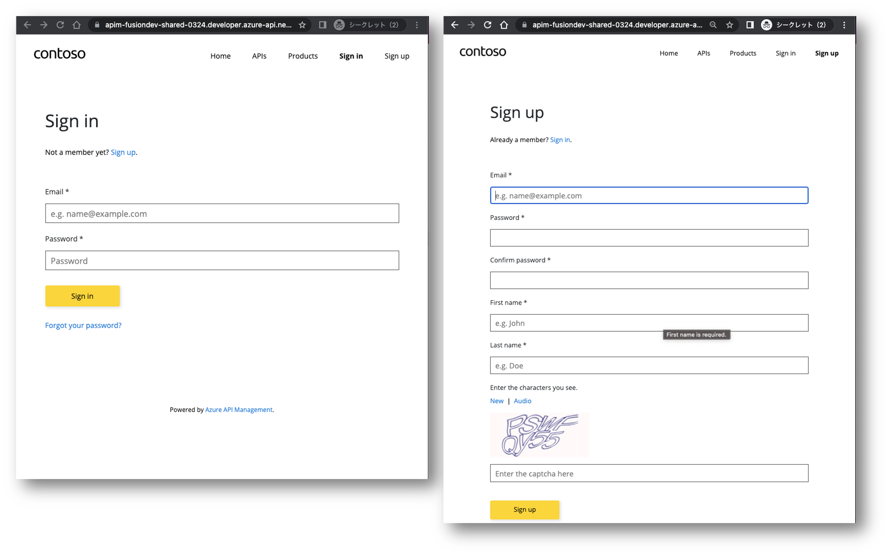
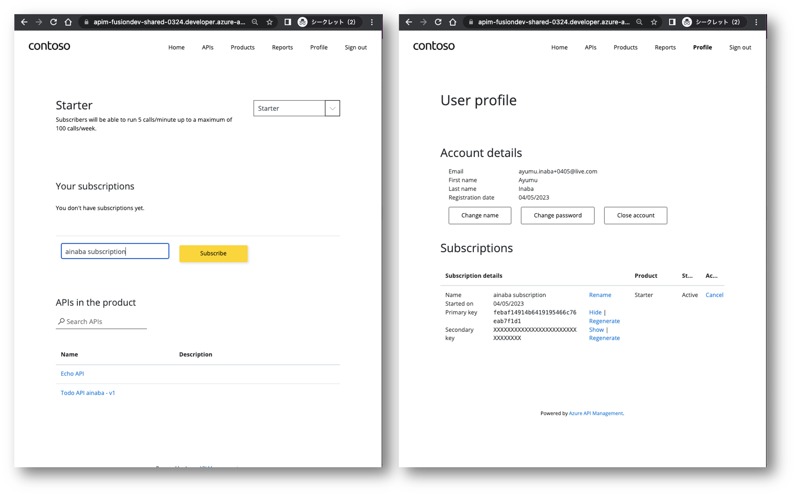

# Section 13 : 開発者ポータルの利用

有効化した開発者ポータルを利用して、API の仕様や API キーが取得できることを確認します。

## 開発者ポータルの URL の取得

まずは、開発者ポータルの URL を確認します。

- Azure Portal を開く
- リソースグループ `rg-fusiondev-shared` を選択
- API Management `apim-fusiondev-shared-MMDD` を選択
- 左のメニューから `概要` を選択
- 開発者ポータルの URL を `クリップボードにコピー` する

ここでリンクをクリックして開いてしまうと、開発者ポータルの編集画面になってしまうのでご注意ください。

## 開発者ポータルの表示

- 認証情報キャッシュを持たないブラウザを表示する
    - Edge の場合は `新しい InPrivate ウィンドウ` を利用
    - Chrome の場合は `新しい シークレット ウィンドウ` を利用
- コピーしておいた開発者ポータルの URL を貼り付けて開く
- 上部の `APIs` メニューを選択
- 自分や他の人が定義した API を選択して、API 仕様を確認
- API definition ドロップダウンから仕様書をダウンロードできることを確認

## サインアップと API キーの取得

**以下の作業は受信可能なメールアドレスが必要です。**

- 上部の `Product` メニューを選択
- `Starter` を選択
- 利用したい API が含まれていることを確認
- `Subscribe` を選択

- Sign in 画面が表示されたら `Sign up` リンクを選択
- Sign up 画面で必要な情報を入力して `Sign up`ボタンを選択
- 入力したメールアドレスにメールが届くので、メール内のリンクをクリックしてアカウントを有効化
- Sign in 画面を表示してメールアドレスとパスワードを入力

- 上部の `Product` メニューを選択
- `Starter` を選択
- サブスクリプション名に `${prefix} subscription` と入力
- `Subscribe` を選択
- User profile 画面で Primary key の `Show` を選択
- API キーが表示されることを確認

## 補足

開発者ポータルを用意しておくと、開発者が API を利用するために必要な情報を自分自身で取得できることがわかります。
つまり業務上適切なタイミングで必要な API を探索、API を介して必要な機能やデータにアクセスできることになります。

## 留意事項

本ハンズオンでは割愛していますが、開発者ポータルは初期設定では任意のユーザーがサインアップすることが可能です。
組織内でのみ利用を許可する API であれば、Azure AD 認証を有効化し、ユーザー名とパスワードによるサインアップを無効化すると良いでしょう。